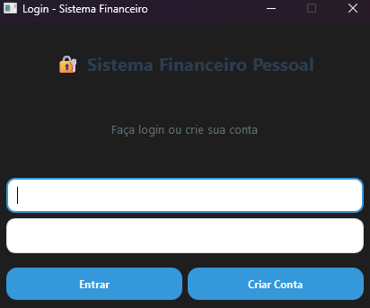
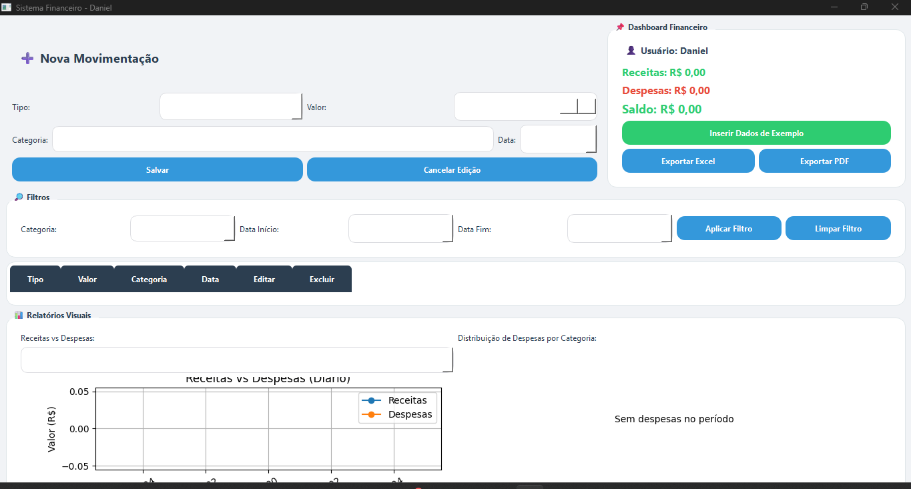

# 💰 App Financeiro (PySide6)

Um aplicativo desktop completo para gestão financeira pessoal, desenvolvido em Python utilizando a biblioteca PySide6 (Qt) para a interface gráfica.

## ✨ Funcionalidades

* **Autenticação Segura:** Sistema de login e registro de usuários com senhas criptografadas (SHA-256).
* **Gestão de Movimentações:** Cadastro, edição e exclusão (CRUD) de receitas e despesas.
* **Dashboard Interativo:** Resumo de saldo e painel com gráficos gerados via Matplotlib (Receitas vs Despesas e Distribuição por Categorias).
* **Filtros Avançados:** Filtre transações por período de data e categorias.
* **Exportação de Relatórios:** Exporte seus dados financeiros para **Excel (.xlsx)** usando Pandas ou gere relatórios em **PDF** via ReportLab.
* **Dados de Exemplo:** Função integrada para popular o banco de dados com dados fictícios para testes rápidos.

## 🛠️ Tecnologias Utilizadas

* **Linguagem:** Python 3
* **Interface Gráfica:** PySide6 (Qt for Python)
* **Banco de Dados:** SQLite3
* **Visualização de Dados:** Matplotlib
* **Manipulação e Exportação:** Pandas, OpenPyXL, ReportLab

## 🚀 Como Executar o Projeto

1. Clone o repositório:
```bash
git clone [https://github.com/daniel-oliveira-kirmse/finance-app.git](https://github.com/daniel-oliveira-kirmse/finance-app.git)
cd finance-app


## 🎨 Interface

**Tela de Login:**


**Dashboard Principal:**
